```{r setup, include=FALSE}
knitr::opts_chunk$set(echo = TRUE)
knitr::opts_knit$set(root.dir = '/home/brian/Dropbox/bycatch/manuscript/spatial-bycatch')
```

This vignette recreates figures from model output in:

> Stock BC, Ward EJ, Eguchi T, Jannot JE, Thorson JT, Feist BE, and Semmens BX. "Random forests outperform other species distribution models for spatiotemporal fisheries bycatch prediction."

  * [Fig. 1: Maps of effort and catch (raw data)](#fig1)
  * [Fig. 2: Compare model performance with boxplots of AUC and RMSE](#fig2)
  * [Fig. 3 / S4: Compare the reduction in bycatch-to-target ratio](#fig3)
  * [Fig. 4: Maps of predicted density (mean) and variablity (log CV)](#fig4)
  * [Fig. 5: Visualize covariate effects for GMRF and RF](#fig5)
  * [Fig. 6: Map the GMRF spatial random field by year (one for each year, only 1 species)](#fig6)
  * [Fig. S3: Map the GMRF spatial random field (one across all years, for each of 3 species)](#figS3)

We assume you either 1) have already seen [`2a_process_survey`](https://rawgit.com/brianstock/spatial-bycatch/master/2a_process_survey.html) and [`2b_run_models`](https://rawgit.com/brianstock/spatial-bycatch/master/2b_run_models.html), or 2) are not interested in how the data were processed/prepared or running the models yourself. Either way, from this point we continue by using the saved output of `2b_run_models`.

*Note:* Because the fisheries observer datasets we used are confidential ([WCGOP](https://www.nwfsc.noaa.gov/research/divisions/fram/observation/data_collection/manuals/2017%20WCGOP%20Training%20Manual%20Final%20website%20copy.pdf), [HILL](http://www.nmfs.noaa.gov/pr/interactions/fkwtrt/meeting1/handouts/observer_manual.pdf)), here we perform the same analyses using the publically available [West Coast Groundfish Trawl Survey](https://www.nwfsc.noaa.gov/research/divisions/fram/groundfish/bottom_trawl.cfm).

### Load data and packages

```{r}
# load the data from 2a_process_survey
load("/home/brian/Dropbox/bycatch/manuscript/spatial-bycatch/wcann_processed.RData")
head(dat)
```

```{r message=FALSE}
library(KernSmooth)
library(fields)
library(PBSmapping)
library(RColorBrewer)
library(INLA)
library(sp)
```

```{r}
# This helper function creates a color scale for use with the image()
# function. Input parameters should be consistent with those
# used in the corresponding image plot. The "axis.pos" argument
# defines the side of the axis. The "add.axis" argument defines
# whether the axis is added (default: TRUE)or not (FALSE).
image.scale <- function(z, zlim, col = heat.colors(12),
breaks, axis.pos=1, add.axis=TRUE, ...){
 if(!missing(breaks)){
  if(length(breaks) != (length(col)+1)){stop("must have one more break than colour")}
 }
 if(missing(breaks) & !missing(zlim)){
  breaks <- seq(zlim[1], zlim[2], length.out=(length(col)+1)) 
 }
 if(missing(breaks) & missing(zlim)){
  zlim <- range(z, na.rm=TRUE)
  zlim[2] <- zlim[2]+c(zlim[2]-zlim[1])*(1E-3)#adds a bit to the range in both directions
  zlim[1] <- zlim[1]-c(zlim[2]-zlim[1])*(1E-3)
  breaks <- seq(zlim[1], zlim[2], length.out=(length(col)+1))
 }
 poly <- vector(mode="list", length(col))
 for(i in seq(poly)){
  poly[[i]] <- c(breaks[i], breaks[i+1], breaks[i+1], breaks[i])
 }
 if(axis.pos %in% c(1,3)){ylim<-c(0,1); xlim<-range(breaks)}
 if(axis.pos %in% c(2,4)){ylim<-range(breaks); xlim<-c(0,1)}
 plot(1,1,t="n",ylim=ylim, xlim=xlim, axes=FALSE, xlab="", ylab="", xaxs="i", yaxs="i", ...)  
 for(i in seq(poly)){
  if(axis.pos %in% c(1,3)){
   polygon(poly[[i]], c(0,0,1,1), col=col[i], border=NA)
  }
  if(axis.pos %in% c(2,4)){
   polygon(c(0,0,1,1), poly[[i]], col=col[i], border=NA)
  }
 }
 box()
 if(add.axis) {axis(axis.pos)}
}
```

### Fig. 1 - Maps of effort and catch (visualize the raw data) {#fig1}

![**Figure 1. Effort and target catch density in the West Coast bottom trawl survey from 2003 to 2012.**     
*Left)* Bivariate kernel density estimate showing smoothed density of fishing effort (7,161 haul locations, `bkde2D` function in R package `KernSmooth`). *Right)* Thin plate spline surface estimating the average density of target catch at a given location, log(pounds groundfish), fit using the `Tps` function from the R package `fields`. Note that the map of total/expected catch would be produced by multiplying effort and target catch densities, just as the binomial and positive components are multiplied in the delta model.](figures/fig1.png){width=500px}

```{r eval=FALSE}
# ---------------------------------------------------------------------------
# Left panel: effort (density of survey trawling activity)
# ---------------------------------------------------------------------------

# Get map boundaries
minX = min(dat$LON)
maxX = max(dat$LON)
minY = min(dat$LAT)
maxY = max(dat$LAT)

# fit 2d kernel density estimate (from KernSmooth package)
#   takes ~1 minute
fit <- bkde2D(x=cbind(dat$LON,dat$LAT), 
	bandwidth=c(0.1,0.1),
	gridsize=c(2000,12000),
	range.x=list(c(minX,maxX),c(minY,maxY)), truncate=TRUE)

# load coastline from PBSmapping package
data(nepacLL) 
attr(nepacLL,"zone")="10" # tell it we're in zone 10

# define legend colors
rf <- colorRampPalette(rev(brewer.pal(11,'Spectral')))
spec200 <- rf(200)

# define 2-panel dimensions
dev.new(width=7.25, height=7)
layout(matrix(c(1,2), nrow=1, ncol=2), widths=c(3.75,3.5), heights=c(7))

# make map of U.S. West Coast
plotMap(nepacLL, xlim=c(minX,maxX),ylim=c(minY,maxY),
   col='grey',main="",plt = c(0.03, 0.97, 0.08, 0.95),
   cex.axis=1.5, cex.lab=1.5)
title("WCANN Effort",line=1)

# add 2d kernel density surface
image(fit$x1,fit$x2,fit$fhat, col = spec200, add=T)

# add back map of U.S. West Coast (on top)
lev = levels(as.factor(nepacLL$PID))
for(i in 1:length(lev)) {
   indx = which(nepacLL$PID == lev[i])
   polygon(nepacLL$X[indx], nepacLL$Y[indx], col = "grey")
}

# add legend color scale
minP <- min(fit$fhat, na.rm=T)
maxP <- max(fit$fhat, na.rm=T)
minP <- 0
maxP <- 1
image.plot(smallplot=c(.85,.88,0.08,0.95), col=spec200,
           zlim=c(round(minP,1),round(maxP,1)), legend.only=TRUE, 
           legend.shrink=0.3, lab.break=round(seq(minP,maxP,length.out=4),1))
```

```{r eval=FALSE}
# ---------------------------------------------------------------------------
# Right panel: total catch (all species)
# ---------------------------------------------------------------------------
# fields::Tps is memory intensive, try sampling 1/2 of locations
frac <- 2
n.dat <- dim(dat)[1]
plot.id <- sample(x=1:n.dat, size=floor(n.dat/frac), replace=F)
plot.id <- plot.id[which(dat$TOTAL[plot.id]>0)]

# fit spline on log(TOTAL)
#   takes ~5 minutes 447
TOTAL.spline.log <- Tps(data.frame(dat$LON[plot.id], dat$LAT[plot.id]), log(dat$TOTAL[plot.id]))
new.grid.log <- predictSurface(TOTAL.spline.log, nx = 500, ny = 3000)

# the lower half of the scale is unused because it's covered by land
# turn onLand points to NA so the scale covers full range over ocean points
new.grid.log$onLand = rep(0,length(new.grid.log$z))
new.grid.log$coords <- as.matrix(expand.grid(new.grid.log$x, new.grid.log$y))
polygons = unique(nepacLL$PID)
for(i in 1:length(polygons)) {
 indx = which(nepacLL$PID == polygons[i])
 new.grid.log$onLand = new.grid.log$onLand +
   point.in.polygon(new.grid.log$coords[,1], new.grid.log$coords[,2],
                    nepacLL$X[indx], nepacLL$Y[indx], mode.checked=FALSE)
}
new.grid.log$z[which(new.grid.log$onLand > 0)] <- NA

# get min and max z values to set color scale bar
minP <- min(new.grid.log$z,na.rm=TRUE)
maxP <- max(new.grid.log$z,na.rm=TRUE)

# plot the map
plotMap(nepacLL, xlim=c(minX,maxX),ylim=c(minY,maxY),
   col='grey',main="",plt = c(0, 0.97, 0.08, 0.95),
   cex.axis=1.5, cex.lab=1.5, yaxt = "n", ylab="")
title("WCANN Catch Density")
rect(minX, minY, maxX, maxY, density = 20, col='grey')
rect(minX, minY, maxX, maxY, density = 20, col='grey', angle=135)

# add spline surface
image(new.grid.log,col=spec200,add=T, breaks = seq(minP,maxP,length.out=201))

# add back coastline on top
lev = levels(as.factor(nepacLL$PID))
for(i in 1:length(lev)) {
   indx = which(nepacLL$PID == lev[i])
   polygon(nepacLL$X[indx], nepacLL$Y[indx], col = "grey")
}

# add color scale bar
image.plot(smallplot=c(.84,.87,0.08,0.95), col=spec200,
           zlim=c(round(minP,2),round(maxP,2)), 
           legend.only=TRUE,legend.shrink=0.3)

# print to png
dev.print(png,"/home/brian/Dropbox/bycatch/manuscript/spatial-bycatch/figures/fig1.png",
          res=400, height=7, width=7.25, units="in")

# save objects for faster plotting in future
save.image("/home/brian/Dropbox/bycatch/manuscript/spatial-bycatch/figures/fig1.RData")
```

### Fig. 2: Compare model performance with boxplots of AUC and RMSE {#fig2}

<center>
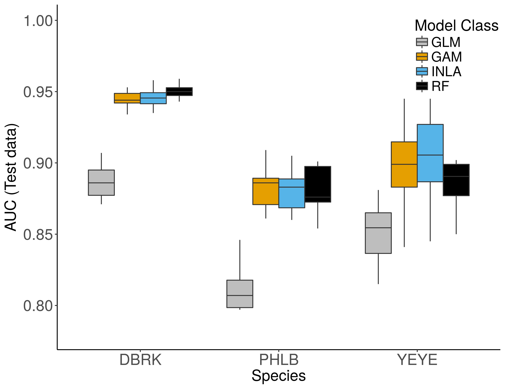{width=450px}

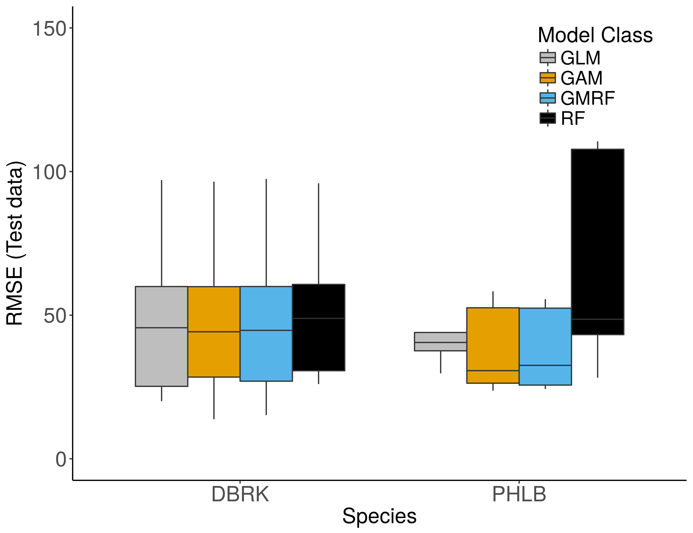{width=450px}

**Figure 2. Predictive performance of the binomial and positive components of the delta model in 10-fold cross-validation on the test data.** *Top)* AUC for the binomial models, and *Bottom)* normalized RMSE for the positive models. Better performance = higher AUC, lower RMSE. Species abbreviations: DBRK = darkblotched rockfish, PHLB = Pacific halibut, YEYE = yelloweye rockfish. Only the best submodel (e.g. CONSTANT, IID, EXCHANGEABLE) within each model class for each species is shown here. *Note: the positive component for the spatial models performed much worse on the survey data (here) compared to the observer data (manuscript text). Important differences: fewer covariates, lower catch rates.*
</center>

```{r eval=FALSE}
# Fig2a: AUC boxplots for all models
# Collect binomial model results
species.bin <- c("DBRK","PHLB","YEYE")
n.species.bin <- length(species.bin)
models.bin <- c("GLM","GAM","INLA","RF") # only use GAM-CONSTANT, INLA-IID, and RF-BASE
best.mod <- c(1,2,5,6) # same best models for all species  
n.models.bin <- length(best.mod)
k=10
AUC <- array(NA,dim=c(n.species.bin, n.models.bin, k))
for(sp in 1:n.species.bin){
  for(f in 1:k){
    load(paste0("/home/brian/Documents/Bycatch/figure_data/fits.bin_",sp,"_",f,".RData"))
    AUC[sp,,f] <- sapply(d, function(l) l[[1]])[best.mod]
  }
}

AUC.df <- reshape2::melt(AUC)
colnames(AUC.df) <- c("species","model","rep","AUC")
AUC.df$species <- as.factor(AUC.df$species)
levels(AUC.df$species) <- species.bin
AUC.df$model <- as.factor(AUC.df$model)
levels(AUC.df$model) <- models.bin

# AUC boxplot (all species + models)
library(ggplot2)
dev.new(width=8.25, height=6.35)
print(ggplot(aes(y = AUC, x = factor(species), fill = factor(model)), data = AUC.df) + 
  geom_boxplot(outlier.colour = NA, fatten=1) +
  theme_bw() +
  xlab("Species") +
  ylab("AUC (Test data)") +
  coord_cartesian(ylim = c(0.78,1)) +
  scale_fill_manual(name="Model Class",labels=models.bin,
                    values=c("grey","#E69F00","#56B4E9","black")) +
  theme(panel.border = element_blank(), panel.grid.major = element_blank(),
        panel.grid.minor = element_blank(), panel.background = element_blank(), 
        axis.line = element_line(colour = "black"), axis.title=element_text(size=18),
        axis.text=element_text(size=18), legend.text=element_text(size=16),
        legend.title=element_text(size=18), legend.position = c(0.9, 0.85)))
dev.print(png,"/home/brian/Dropbox/bycatch/manuscript/spatial-bycatch/figures/fig2a_AUC.png", 
          bg="white",res=400, width=8.25, height=6.35, units="in")

```

```{r eval=FALSE}
# --------------------------------------------------------------------
# Fig2b: RMSE boxplots for all models
# Collect positive model results
species.pos <- c("DBRK","PHLB")
n.species.pos <- length(species.pos)
models.pos <- c("GLM","GAM","GMRF","RF")
best.mod <- c(1,2,4,6) # GAM CONSTANT and GMRF CONSTANT
n.models.pos <- length(models.pos)
k=10
RMSE <- array(NA,dim=c(n.species.pos, n.models.pos, k))
for(sp in 1:n.species.pos){
  for(f in 1:k){
    load(paste0("/home/brian/Documents/Bycatch/figure_data/fits.pos_",sp,"_",f,".RData"))
    d[sapply(d, is.null)] <- NA
    RMSE[sp,,f] <- sapply(d, function(l) l[[1]])[best.mod]
  }
}

RMSE.df <- reshape2::melt(RMSE)
colnames(RMSE.df) <- c("species","model","rep","RMSE")
RMSE.df$species <- as.factor(RMSE.df$species)
levels(RMSE.df$species) <- species.pos
RMSE.df$model <- as.factor(RMSE.df$model)
levels(RMSE.df$model) <- models.pos

# RMSE boxplot (all species + models)
library(ggplot2)
dev.new()
print(ggplot(aes(y = RMSE, x = factor(species), fill = factor(model)), data = RMSE.df) + 
  geom_boxplot(outlier.colour = NA, fatten=1) +
  coord_cartesian(ylim = c(0,150)) +
  theme_bw() +
  xlab("Species") +
  ylab("RMSE (Test data)") +
  scale_fill_manual(name="Model Class",labels=models.pos,
                    values=c("grey","#E69F00","#56B4E9","black")) +
  theme(panel.border = element_blank(), panel.grid.major = element_blank(), 
        panel.grid.minor = element_blank(), panel.background = element_blank(), 
        axis.line = element_line(colour = "black"), axis.title=element_text(size=18),
        axis.text=element_text(size=18), legend.text=element_text(size=16),
        legend.title=element_text(size=18), legend.position = c(0.85, 0.85)))
dev.print(png,"/home/brian/Dropbox/bycatch/manuscript/spatial-bycatch/figures/fig2b_RMSE.png",
          bg="white",res=400, width=8.25, height=6.35, units="in")
```

### Fig. 3 / S4: Compare the reduction in bycatch-to-target ratio {#fig3}

![**Figure 3. Bycatch-to-target ratio achieved by using the binomial component of the delta model to predict and remove fishing sets in the test data, relative to 0% fishing removed.** Lines show median of 10-fold cross-validation runs for each model class, averaged across all species. Shaded areas are bootstrapped 95% confidence intervals for the median. As in Figure 2, only the best submodel within each model class for each species is shown here. *Note: Confidence intervals are wider here than in manuscript because we only ran 10-fold CV instead of 5-fold CV repeated 10x.*](figures/fig3_avg.png){width=450px}

![**Figure S4. Bycatch-to-target ratio achieved by using the binomial component of the delta model to predict and remove fishing sets in the test data, relative to 0% fishing removed.** Results are noisier for species with few bycatch events (e.g. YEYE). Species abbreviations: DBRK = darkblotched rockfish, PHLB = Pacific halibut, YEYE = yelloweye rockfish. Lines show median of 10-fold cross-validation runs for each model class. Shaded areas are bootstrapped 95% confidence intervals for the median. As in Figure 2, only the best submodel within each model class for each species is shown here. *Note: Confidence intervals are wider here than in manuscript because we only ran 10-fold CV instead of 5-fold CV repeated 10x.*](figures/fig3_all.png){width=700px}


```{r eval=FALSE}
  species.labs <- c("DBRK","PHLB","YEYE")
  n.sp <- length(species.labs)
  model.labs <- c("GLM","GAM","INLA","RF") # only use GAM-CONSTANT, INLA-IID, and RF-BASE
  best.mod <- c(1,2,5,6) # same best models for both species

  f.rem <- seq(from=0,by=.005,to=.1) # 1%, 2%, 5%, 10% fishing removed
  n.f <- length(f.rem)

  n.mod <- length(model.labs)
  n.rep <- 10 # number of cross-validation folds
  # for sp, predict f% test locations using model, test data rep 
  bycatch.rem <- array(NA,dim=c(n.f,n.sp,n.mod,n.rep))
  # target catch REMOVED from test dataset by predicting f% locations
  target.rem <- array(NA,dim=c(n.f,n.sp,n.mod,n.rep)) 
  # how much bycatch sp LEFT after removing f% tows?
  bycatch.left <- array(NA,dim=c(n.f,n.sp,n.mod,n.rep)) 
  # how much target catch LEFT after removing f% tows?
  target.left <- array(NA,dim=c(n.f,n.sp,n.mod,n.rep)) 
  # total bycatch of sp in test data rep (all locations)
  bycatch <- array(NA,dim=c(n.f,n.sp,n.mod,n.rep)) 
  # target bycatch in test data rep (all locations)
  target <- array(NA,dim=c(n.f,n.sp,n.mod,n.rep)) 
  # % reduction in bycatch:target ratio
  ratio.reduction <- array(NA,dim=c(n.f,n.sp,n.mod,n.rep)) 
  # % reduction in bycatch
  bycatch.reduction <- array(NA,dim=c(n.f,n.sp,n.mod,n.rep)) 
  # % reduction in target
  target.reduction <- array(NA,dim=c(n.f,n.sp,n.mod,n.rep)) 

  # for all species and models, load predicted bycatch probabilities
  for(sp in 1:n.sp){
    for(rep in 1:n.rep){
      load(paste0("/home/brian/Documents/Bycatch/figure_data/fits.bin_",sp,"_",rep,".RData"))
      dat.test <- dat[d[[4]]$test.id, ]
      target[,sp,,rep] <- sum(dat.test$TOTAL)
      bycatch[,sp,,rep] <- sum(dat.test[,species.labs[sp]])

      # for each model:
      #   1. get cutoff points for each level of fishing remaining
      #   2. find hauls with predicted bycatch probabilities above cutoff
      #   3. add up bycatch and target catch of these 'removed' hauls
      for(m in 1:n.mod){
        cuts <- quantile(d[[best.mod[m]]][[3]],probs=1-f.rem) 
        for(f in 1:n.f){
          rem <- d[[best.mod[m]]][[3]] > cuts[f]
          bycatch.rem[f,sp,m,rep] <- sum(dat.test[rem,species.labs[sp]])
          target.rem[f,sp,m,rep] <- sum(dat.test[rem,"TOTAL"])
        }          
      }
    }
  }

  # calculate reduction in bycatch-to-target ratio
  bycatch.left <- bycatch - bycatch.rem
  target.left <- target - target.rem
  bycatch.reduction <- bycatch.left/bycatch
  target.reduction <- target.left/target
  ratio.reduction <- (bycatch.left/target.left)/(bycatch/target)

  # put in long data format
  ratio.df <- plyr::adply(ratio.reduction,1:n.mod)
  names(ratio.df) <- c("f","Species","Model","Rep","ratio.red")
  levels(ratio.df$f) <- f.rem
  levels(ratio.df$Species) <- species.labs
  ratio.df$f <- as.numeric(as.character(ratio.df$f))

  # https://stackoverflow.com/questions/14255533/pretty-ticks-for-log-normal-scale-using-ggplot2-dynamic-not-manual
  base_breaks <- function(){
      function(x) {
          axisTicks(log10(range(x, na.rm = TRUE)), log = TRUE, n = 5)[2:5]
      }
  }

  # Get bootstrap median with CI, https://rpubs.com/dgolicher/median_boot
  median_cl_boot <- function(x, conf = 0.95) {
      lconf <- (1 - conf)/2
      uconf <- 1 - lconf
      require(boot)
      bmedian <- function(x, ind) median(x[ind])
      bt <- boot(x, bmedian, 1000)
      bb <- boot.ci(bt, type = "perc")
      data.frame(y = median(x), 
                 ymin = quantile(bt$t, lconf), 
                 ymax = quantile(bt$t, uconf))
  }

  # Figure S4 (panel plot all species)
  library(ggplot2)
  png("/home/brian/Dropbox/bycatch/manuscript/spatial-bycatch/figures/figS4_ratio_reduction_allsp.png",
      units = 'in',height=4,width=7,res=300)
  print(
    ggplot(ratio.df, aes(x = f, y = ratio.red, colour=Model, fill=Model,group=Model)) +
    stat_summary(fun.data = median_cl_boot, alpha=.5, color=NA,geom="ribbon") +
    stat_summary(fun.y=median, geom="line",size=1.5, na.rm = TRUE) +  
    theme_bw() +
    facet_wrap(~Species) +
    scale_x_continuous(labels=scales::percent, breaks=c(.01,.05,.1)) +  
    xlab("Fishing effort removed") +
    ylab("Relative bycatch:target") +
    scale_colour_manual(name="Model",labels=c("GLM","GAM","GMRF","RF"),
                        values=c("grey","#E69F00", "#56B4E9","black")) +
    scale_fill_manual(name="Model",labels=c("GLM","GAM","GMRF","RF"),
                      values=c("grey","#E69F00", "#56B4E9","black")) +  
    theme(panel.border = element_blank(), panel.grid.major = element_blank(),
          panel.grid.minor = element_blank(), panel.background = element_blank(),
          axis.line = element_line(colour = "black"), axis.title=element_text(size=14),
          axis.text=element_text(size=12), legend.text=element_text(size=12),
          legend.title=element_blank(), legend.position = c(0.88, 0.9),
          legend.key.width = unit(0.5, "in")) 
  )
  dev.off()

  # Figure 3 (average across all species for each model)
  png("/home/brian/Dropbox/bycatch/manuscript/spatial-bycatch/figures/fig3_ratio_reduction_avg.png",
      units = 'in',height=7,width=7,res=300)
  print(
    ggplot(ratio.df, aes(x = f, y = ratio.red, colour=Model, fill=Model,group=Model)) +
    stat_summary(fun.data = median_cl_boot, alpha=.5, color=NA,geom="ribbon") +
    stat_summary(fun.y=median, geom="line",size=1.5, na.rm = TRUE) +
    theme_bw() +
    scale_x_continuous(labels=scales::percent, breaks=c(0,.025,.05,.075,.1)) +  
    coord_cartesian(ylim = c(0.5,1)) +
    # scale_y_continuous(labels=scales::percent) +
    xlab("Fishing effort removed") +
    ylab("Relative bycatch:target") +
    scale_colour_manual(name="Model",labels=c("GLM","GAM","GMRF","RF"), 
                        values=c("grey","#E69F00", "#56B4E9","black")) +
    scale_fill_manual(name="Model",labels=c("GLM","GAM","GMRF","RF"),
                      values=c("grey","#E69F00", "#56B4E9","black")) +
    theme(panel.border = element_blank(), panel.grid.major = element_blank(),
          panel.grid.minor = element_blank(), panel.background = element_blank(),
          axis.line = element_line(colour = "black"), axis.title=element_text(size=14),
          axis.text=element_text(size=12), legend.text=element_text(size=12),
          legend.title=element_blank(), legend.position = c(0.88, 0.9), 
          legend.key.width = unit(0.5, "in")) 
  )
  dev.off()
```

### Fig. 4: Maps of predicted density (mean) and variablity (log CV) {#fig4}

**Figure 4. Maps of darkblotched rockfish catch predictions with uncertainty for the West Coast bottom trawl survey in 2012 from the GMRF and random forest (RF) models (binomial x positive = expected).** *a)* Log mean expected bycatch from the GMRF-CONSTANT model. *b)* Log variance of expected bycatch from the GMRF-CONSTANT model. *c)* Log mean expected bycatch from the RF-BASE model. *d)* Log variance of expected bycatch from the RF-BASE model. Maps created by both models show artifacts of their construction: the mesh triangulation is evident in the GMRF variance map (b), and the sharp gradients in the RF mean (c) and variance (d) maps are a consequence of RF trees splitting on latitude and longitude.

The code to produce Figure 2 is quite long:

```{r eval=FALSE}
```

### Fig. 5: Visualize covariate effects for GMRF and RF {#fig5}

<center>
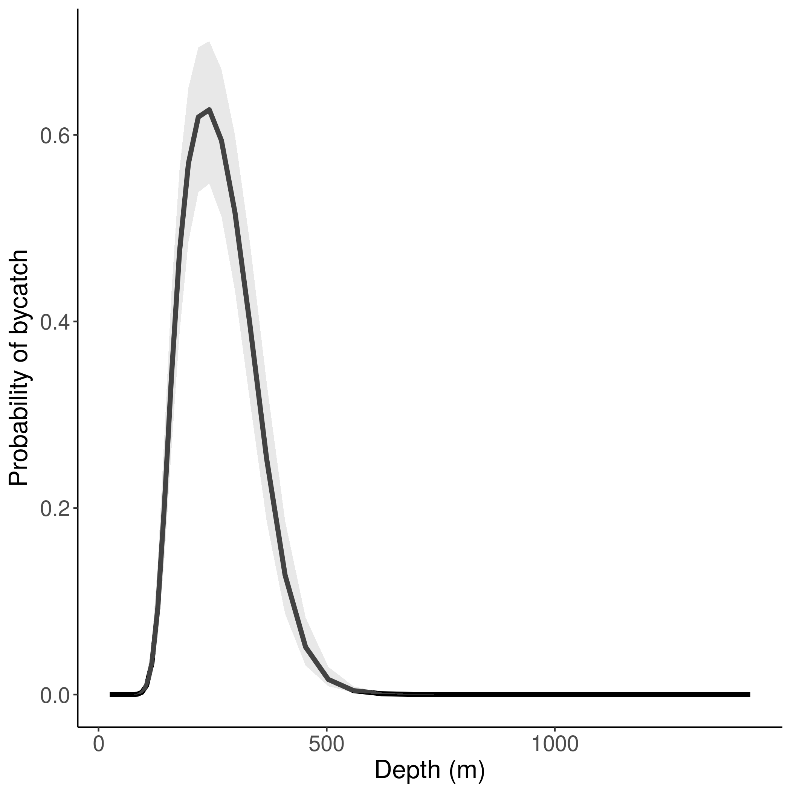{width=200px} 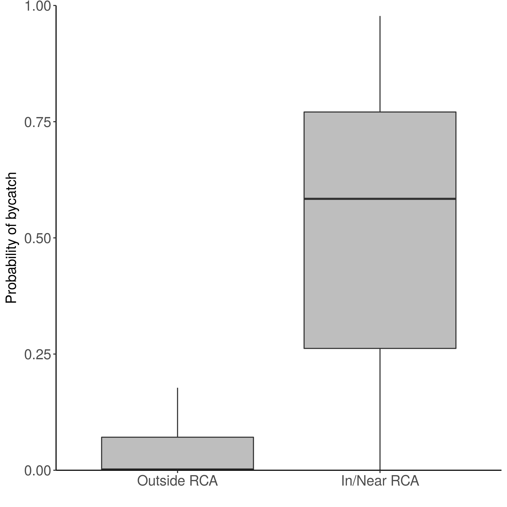{width=200px} 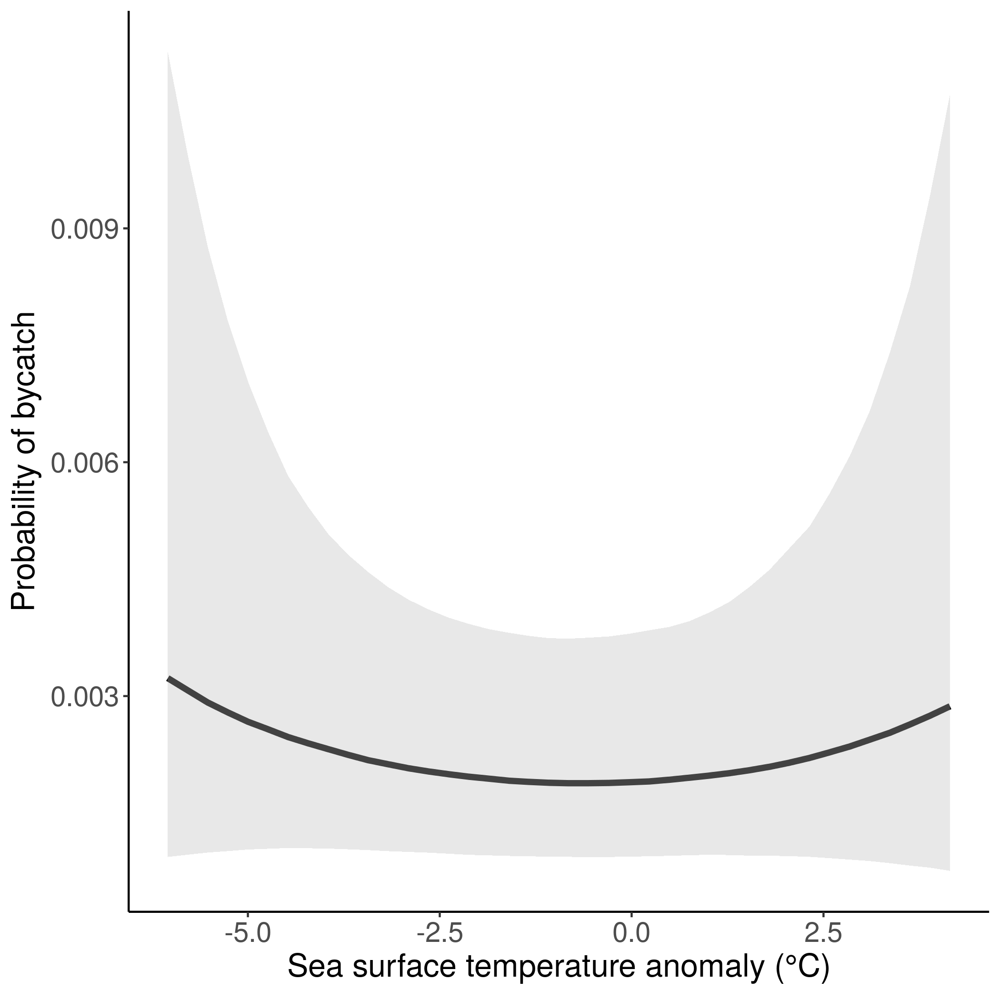{width=200px}

**Figure 5a. Covariate effects estimated by the GMRF CONSTANT binomial model for darkblotched rockfish.** *(L-R)* GMRF CONSTANT estimates a quadratic effect of Depth, a positive effect of In/Near RCA (haul location inside or near rockfish conservation area boundary), and no effect of SST (sea surface temperature anomaly). The response for the binomial model is (by)catch probability. GMRF covariate effects are marginal posterior distributions (`INLA` package in R).

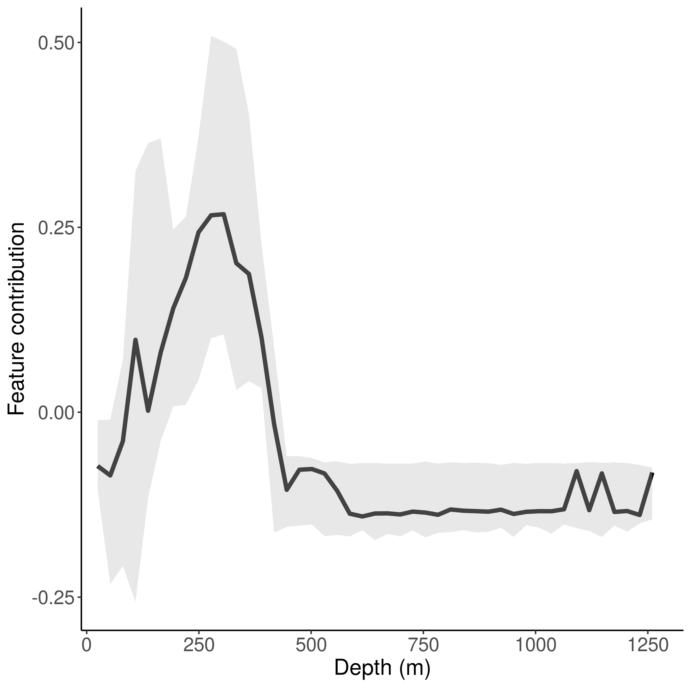{width=200px} 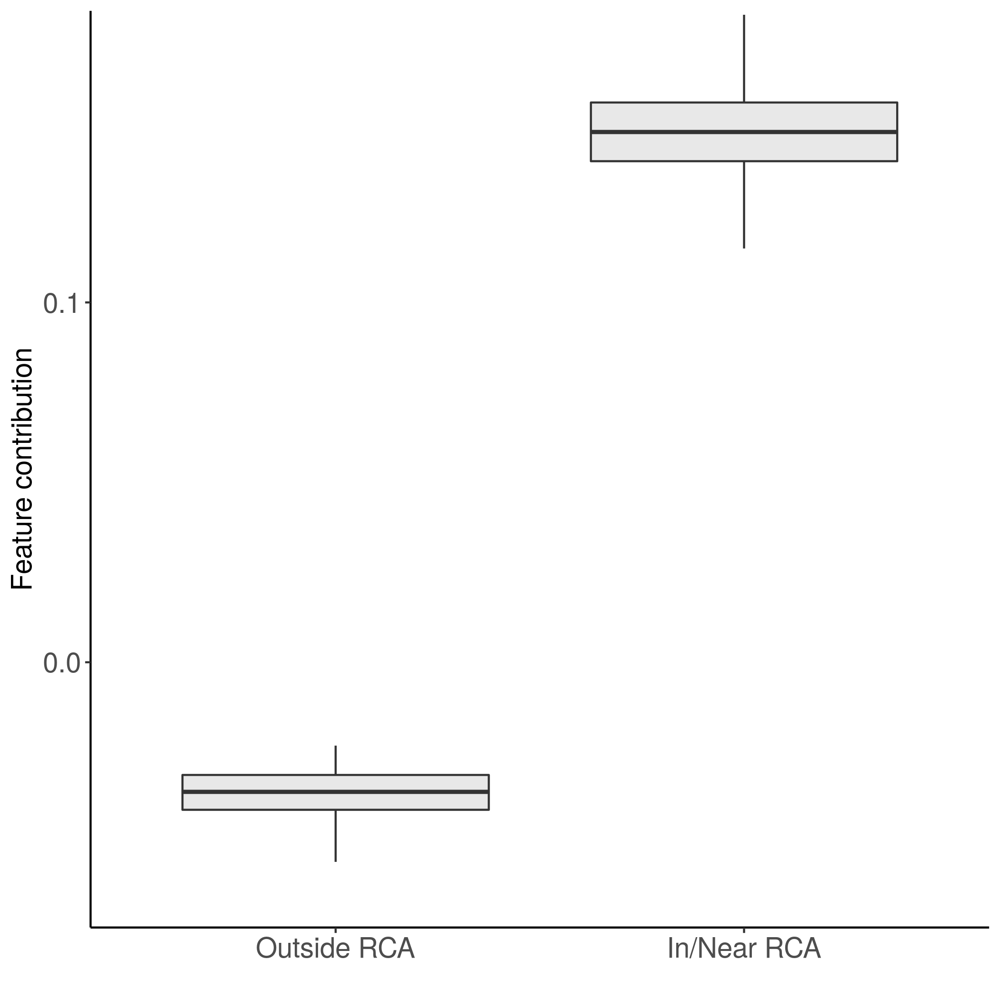{width=200px} 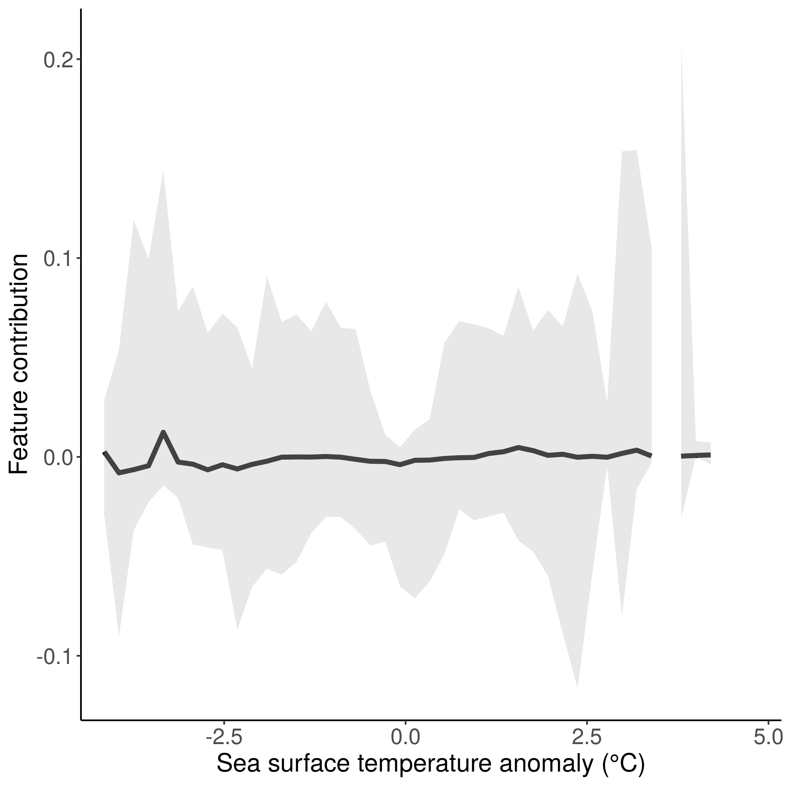{width=200px}

**Figure 5b. Covariate effects estimated by the Random Forest binomial model for darkblotched rockfish.** *(L-R)* RF estimates similar covariate effects to the GMRF model: a quadratic effect of Depth, a positive effect of In/Near RCA (haul location inside or near rockfish conservation area boundary), and no effect of SST (sea surface temperature anomaly). RF covariate effects are feature contributions (`forestFloor` package in R).
</center>


```{r eval=FALSE}
library(dplyr)
library(mvtnorm)
library(ggplot2)
library(reshape2)
```

```{r eval=FALSE}
# --------------------------------------------------
# Step 5-1: GMRF marginals
species.labels <- c("DBRK","PHLB")
mods <- c("bin","pos")
# Change sp and m to run for other species / models
# Here we show results from DBRK binomial model
sp=1
m=1
load(paste0("/home/brian/Documents/Bycatch/figure_data/fits.",
            mods[m],"_",sp,"_1.RData")) # use fold 1
out.inla <- d[[4]]$out.inla
setwd(paste0("/home/brian/Documents/Bycatch/figure_data/fig5_marginals/",
             species.labels[sp],"_",mods[m]))

# -------------------------------------------------------------------
# Plot marginals over continuous covariates (sst, depth)
N = 10000
coefs.pres = rmvnorm(N, mean = out.inla$summary.fixed[,1], 
                     sigma = (out.inla$misc$lincomb.derived.covariance.matrix))
covar <- rownames(out.inla$summary.fixed)

# -------------------------------------------------------------
# Marginal over sst anomaly
minCovar = min(dat[,"sst"],na.rm=T)
maxCovar = max(dat[,"sst"],na.rm=T)
rangeCovar = seq(minCovar,maxCovar,length.out=40)
predPos = matrix(sort(rep(rangeCovar,N)), N, length(rangeCovar))
covarEff = matrix(sort(rep(rangeCovar,N)), N, length(rangeCovar))
for(i in 1:N) {
  # calculate Pr(bycatch), using sst and mean of other covariates:
  predPos[i,] = mean(coefs.pres[i,7:15]) + # mean of year fixed effects
                (covarEff[i,])*coefs.pres[i,3] + # sst
                (covarEff[i,]^2)*coefs.pres[i,4] + # sst2
                mean(dat$logDEPTH,na.rm=T)*coefs.pres[i,1] + # mean of logDEPTH
                mean(dat$logDEPTH2,na.rm=T)*coefs.pres[i,2] + # mean of logDEPTH2
                mean(as.numeric(as.character(dat$inRCA)))*coefs.pres[i,5] + # mean of inRCA
                mean(dat$DAY)*coefs.pres[i,6] # mean of DAY
}
if(m==1){
  # convert back to p-space (inverse logit)
  predPos.norm = exp(predPos)/(1+exp(predPos))
  y.lab <- "Probability of bycatch"
}
if(m==2){
  # convert back to kg (from log-space)
  predPos.norm = exp(predPos)
  y.lab <- "Expected bycatch density (mt)"
}
# put x axis back on original (un-centered) scale
origCovar = rangeCovar + mean(dat$SST) 

x.lab <- expression(paste("Sea surface temperature anomaly (",degree,"C)",sep=""))
df <- data.frame(x=origCovar, 
                 med=apply(predPos.norm,2,median),
                 low=apply(predPos.norm,2,quantile,0.025),
                 high=apply(predPos.norm,2,quantile,0.975))
png(paste0("marginal_",species.labels[sp],"_",mods[m],"_SST.png"),
    units = 'in',height=7,width=7,res=300)
print(ggplot2::ggplot(data=df,ggplot2::aes(x=x,y=med)) +
  ggplot2::geom_line(ggplot2::aes(x=x, y=med),size=1.5) +
  ggplot2::geom_ribbon(ggplot2::aes(ymin=low, ymax=high), 
                       fill="grey",alpha=0.35) +
  ggplot2::ylab(y.lab) +
  ggplot2::xlab(x.lab) +
  ggplot2::theme_bw() +
  ggplot2::theme(panel.border = ggplot2::element_blank(), 
                 panel.grid.major = ggplot2::element_blank(), 
                 panel.grid.minor = ggplot2::element_blank(), 
                 panel.background = ggplot2::element_blank(),
                 axis.line = ggplot2::element_line(colour = "black"),
                 axis.title=ggplot2::element_text(size=16), 
                 axis.text=ggplot2::element_text(size=14),
                 legend.text=ggplot2::element_text(size=14)))
dev.off()

# -------------------------------------------------------------
# Marginal over depth
minCovar = min(dat[,"logDEPTH"],na.rm=T)
maxCovar = max(dat[,"logDEPTH"],na.rm=T)
rangeCovar = seq(minCovar,maxCovar,length.out=40)
predPos = matrix(sort(rep(rangeCovar,N)), N, length(rangeCovar))
covarEff = matrix(sort(rep(rangeCovar,N)), N, length(rangeCovar))
for(i in 1:N) {
  # calculate Pr(bycatch), using sst and mean of other covariates:
  predPos[i,] = mean(coefs.pres[i,7:15]) + # mean of year fixed effects
                mean(dat$sst,na.rm=TRUE)*coefs.pres[i,3] + # sst
                mean(dat$sst2,na.rm=TRUE)*coefs.pres[i,4] + # sst2
                (covarEff[i,])*coefs.pres[i,1] + # mean of logDEPTH
                (covarEff[i,]^2)*coefs.pres[i,2] + # mean of logDEPTH2
                mean(as.numeric(as.character(dat$inRCA)))*coefs.pres[i,5] + # mean of inRCA
                mean(dat$DAY)*coefs.pres[i,6] # mean of DAY      
}
if(m==1){
  # convert back to p-space (inverse logit)
  predPos.norm = exp(predPos)/(1+exp(predPos))
  y.lab <- "Probability of bycatch"
}
if(m==2){
  # convert back to kg (from log-space)
  predPos.norm = exp(predPos)
  y.lab <- "Expected bycatch density (mt)"
}
# put x axis back on original (un-centered, un-transformed) scale
origCovar = exp(rangeCovar + mean(log(dat$DEPTH)))

x.lab <- "Depth (m)"
df <- data.frame(x=origCovar, 
                 med=apply(predPos.norm,2,median),
                 low=apply(predPos.norm,2,quantile,0.025),
                 high=apply(predPos.norm,2,quantile,0.975))
png(paste0("marginal_",species.labels[sp],"_",mods[m],"_DEPTH.png"),
    units = 'in',height=7,width=7,res=300)
print(ggplot2::ggplot(data=df,ggplot2::aes(x=x,y=med)) +
  ggplot2::geom_line(ggplot2::aes(x=x, y=med),size=1.5) +
  ggplot2::geom_ribbon(ggplot2::aes(ymin=low, ymax=high), 
                       fill="grey",alpha=0.35) +
  ggplot2::ylab(y.lab) +
  ggplot2::xlab(x.lab) +
  ggplot2::theme_bw() +
  ggplot2::theme(panel.border = ggplot2::element_blank(), 
                 panel.grid.major = ggplot2::element_blank(),
                 panel.grid.minor = ggplot2::element_blank(), 
                 panel.background = ggplot2::element_blank(), 
                 axis.line = ggplot2::element_line(colour = "black"),
                 axis.title=ggplot2::element_text(size=16), 
                 axis.text=ggplot2::element_text(size=14),
                 legend.text=ggplot2::element_text(size=14)))
dev.off()   

# -----------------------------------------------------
# Marginal inRCA
ind.pred <- inla.stack.index(d[[4]]$sdat.full,'sdat.fit')$data
pred.real <- out.inla$summary.fitted.values[ind.pred,"mean"]
obs <- dat$inRCA[d[[4]]$fit.id]
ind0 <- which(obs==0)
ind1 <- which(obs==1)

n.pres <- length(which(obs==1))
n.abs <- length(which(obs==0))
pred.occur.df <- data.frame(matrix(NA, nrow = d[[4]]$n.fit, ncol = 2))
names(pred.occur.df) <- c("Outside RCA","In/Near RCA")
pred.occur.df[1:n.abs,1] <- pred.real[which(obs==0)]
pred.occur.df[1:n.pres,2] <- pred.real[which(obs==1)]
pred.occur.df.plot <- melt(pred.occur.df)

if(m==1) y.lab <- "Probability of bycatch"
if(m==2) y.lab <- "Expected bycatch density (mt)"

png(paste0("marginal_",species.labels[sp],"_",mods[m],"_inRCA.png"),
    units = 'in',height=7,width=7,res=300)

if(m==2){
  max.y <- quantile(pred.occur.df.plot$value,.99,na.rm=T)
  print(ggplot(pred.occur.df.plot, aes(x = variable, y = value)) +
    geom_boxplot(fill="grey", outlier.shape=NA) +
    theme_bw() +
    coord_cartesian(ylim = c(0,max.y)) +
    scale_y_continuous(expand = c(0, 0)) + 
    xlab("") +
    ylab("Expected bycatch density (mt)") +
    theme(panel.border = element_blank(), panel.grid.major = element_blank(),
          panel.grid.minor = element_blank(), panel.background = element_blank(),
          axis.line = element_line(colour = "black"),   
          axis.title=element_text(size=14), axis.text=element_text(size=14),
          legend.text=element_text(size=12), legend.title=element_text(size=14)))
}
if(m==1){
  print(ggplot(pred.occur.df.plot, aes(x = variable, y = value)) +
  geom_boxplot(fill="grey", outlier.shape=NA) +
  theme_bw() +
  coord_cartesian(ylim = c(0,1)) +
  scale_y_continuous(expand = c(0, 0)) + 
  xlab("") +
  ylab("Probability of bycatch") +
  theme(panel.border = element_blank(), panel.grid.major = element_blank(),
        panel.grid.minor = element_blank(), panel.background = element_blank(),
        axis.line = element_line(colour = "black"),
        axis.title=element_text(size=14), axis.text=element_text(size=14),
        legend.text=element_text(size=12), legend.title=element_text(size=14)))
}
dev.off()
```

```{r eval=FALSE}
# -------------------------------------------------------
# Step 5-2: random forest feature contributions
# need to re-run RF with keep.inbag=TRUE
# get test/train indicies for same fold we just used for GMRF marginals
library(randomForest)
library(forestFloor)
test.id <- ind[[sp]][[1]] 
fit.id <- dat[-test.id,"id"]
covar <- c("DEPTH", "sst", "inRCA", "DAY", "YEAR", "LAT", "LON")
n.covar <- length(covar)

# get correct column of dat (bin vs. pos)
if(m==1) sp.ind <- paste0(species.labels[sp],"_01")
if(m==2) sp.ind <- species.labels[sp]

# fit random forest
fit <- randomForest(x=dat[fit.id, covar], y=dat[fit.id, sp.ind], 
                    mtry=3, ntree=1000, importance=FALSE, do.trace=250, 
                    keep.forest=TRUE, keep.inbag=TRUE)

# use forestFloor to calculate feature contributions of each covariate
ff.bin = forestFloor(
  rf.fit = fit,       # mandatory
  X = dat[fit.id,covar],
  calc_np = FALSE,    # TRUE or FALSE both works, makes no difference
  binary_reg = TRUE  # takes no effect here when rfo$type="regression"
)

# simple plot of each covariate one by one
for(i in 1:n.covar){
  png(paste0("RFmarginal_",species.labels[sp],"_",mods[m],"_",covar[i],".png"),
      units = 'in',height=7,width=7,res=300)
  plot(ff.bin,                  # forestFloor object
       plot_seq = i,
       col="grey",              # optional sequence of features to plot
       orderByImportance=FALSE) # if TRUE index sequence by importance
  dev.off()
}

# ------------------------------------------------------
# nicer plots, comparable to GMRF marginals
# 1. categorical covarate (inRCA)
obs.RCA <- dat[fit.id,"inRCA"]
obs <- dat[fit.id,sp.ind]
RCA.col <- match("inRCA",attributes(ff.bin$FCmatrix)$dimnames[[2]])
pred.real <- ff.bin$FCmatrix[,RCA.col]
ind0 <- which(obs.RCA==0)
ind1 <- which(obs.RCA==1)

n.in <- length(which(obs.RCA==1))
n.out <- length(which(obs.RCA==0))
pred.occur.df <- data.frame(matrix(NA, nrow = length(obs.RCA), ncol = 2))
names(pred.occur.df) <- c("Outside RCA","In/Near RCA")
pred.occur.df[1:n.out,1] <- pred.real[which(obs.RCA==0)]
pred.occur.df[1:n.in,2] <- pred.real[which(obs.RCA==1)]
pred.occur.df.plot <- melt(pred.occur.df)

y.lab <- "Feature contribution"

png(paste0("RFmarginal_",species.labels[sp],"_",mods[m],"_inRCA.png"),
    units = 'in',height=7,width=7,res=300)
print(ggplot(pred.occur.df.plot, aes(x = variable, y = value)) +
        geom_boxplot(fill="grey", alpha=0.35, outlier.shape=NA) +
        theme_bw() +
        coord_cartesian(ylim = quantile(pred.occur.df.plot$value, c(0.01, 0.99), na.rm=T)) +
        xlab("") +
        ylab(y.lab) +
        theme(panel.border = element_blank(), panel.grid.major = element_blank(),
              panel.grid.minor = element_blank(), panel.background = element_blank(),
              axis.line = element_line(colour = "black"),
              axis.title=element_text(size=14), axis.text=element_text(size=14),
              legend.text=element_text(size=12), legend.title=element_text(size=14)))
dev.off()

# ------------------------------------------------
# 2. Continuous covariates (sst, depth)
labels <- c("Depth (m)", 
            expression(paste("Sea surface temperature anomaly (",degree,"C)",sep="")))
cov.labs <- c("DEPTH","sst")
cov <- c(1,2) # get indices of sst and depth
for(c in 1:length(labels)){
  n.bin = 50
  fc <- ff.bin$FCmatrix[,cov[c]]
  x <- dat[fit.id, cov.labs[c]]
  xbin <- seq(from=min(x),to=max(x),length.out=n.bin+1)
  fc.low <- fc.high <- fc.med <- x.med <- bin.n <- rep(NA,n.bin)
  for(bin in 1:n.bin){
    b <- which(x > xbin[bin] & x < xbin[bin+1])
    fc.low[bin] <- quantile(fc[b],.025)
    fc.high[bin] <- quantile(fc[b],.975)
    fc.med[bin] <- median(fc[b])
    x.med[bin] <- median(x[b])
    bin.n[bin] <- length(x[b])
    if(bin.n[bin] < 5) fc.low[bin] <- fc.high[bin] <- fc.med[bin] <- x.med[bin] <- NA
  }
  minX <- min(x.med,na.rm=T)
  maxX <- max(x.med,na.rm=T)
  df <- data.frame(med=fc.med,low=fc.low,high=fc.high,x=xbin[1:n.bin])
  png(paste0("RFmarginal_",species.labels[sp],"_",mods[m],"_",cov.labs[c],".png"),
      units = 'in',height=7,width=7,res=300)
  print(ggplot2::ggplot(data=df,ggplot2::aes(x=x,y=med)) +
        ggplot2::geom_line(ggplot2::aes(x=x, y=med),size=1.5) +
        ggplot2::geom_ribbon(ggplot2::aes(ymin=low, ymax=high), fill="grey",alpha=0.35) +
        ggplot2::ylab("Feature contribution") +
        ggplot2::xlab(labels[c]) +
        coord_cartesian(xlim = c(minX,maxX)) +
        ggplot2::theme_bw() +
        ggplot2::theme(panel.border = ggplot2::element_blank(), 
                       panel.grid.major = ggplot2::element_blank(),
                       panel.grid.minor = ggplot2::element_blank(), 
                       panel.background = ggplot2::element_blank(),
                       axis.line = ggplot2::element_line(colour = "black"),
                       axis.title=ggplot2::element_text(size=16), 
                       axis.text=ggplot2::element_text(size=14),
                       legend.text=ggplot2::element_text(size=14),
                       legend.position=c(.02,1),
                       legend.justification=c(0,1),
                       legend.title=ggplot2::element_blank()))
  dev.off()
}
```

### Fig. 6: Map the GMRF spatial random field by year (one for each year, only 1 species) {#fig6}

<center>
{width=141px} 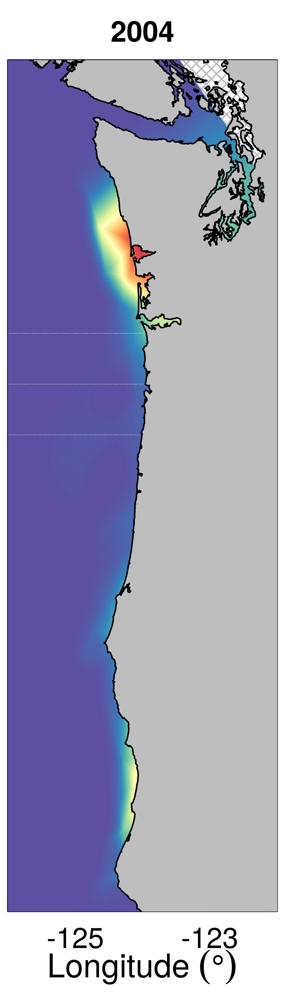{width=104px} 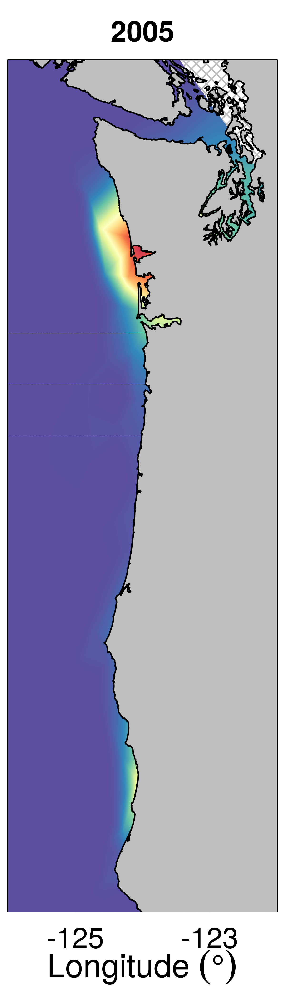{width=104px} 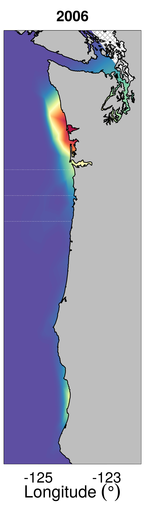{width=104px} 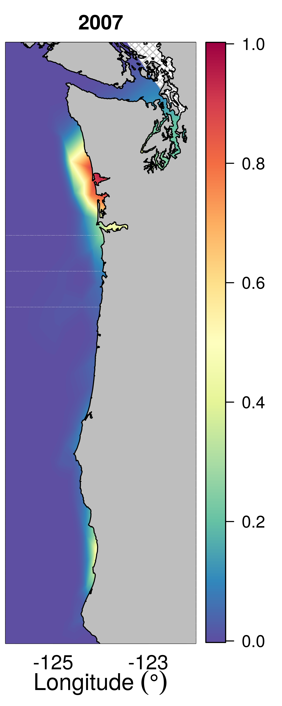{width=146px}

**Figure 6. GMRF-EXCHANGEABLE random field for bycatch probability of darkblotched rockfish from 2008 to 2012.** There is less year-to-year variability in the GMRF in the survey data (here) than in the observer data (manuscript).
</center>

```{r eval=FALSE}
# helper function (see beginning of this page)
source("/home/brian/Dropbox/bycatch/manuscript/figures/fig1_effort_catch/image.scale.R")
library(fields)

# Get model object (DBRK binomial, fold 1)
load(paste0("/home/brian/Documents/Bycatch/figure_data/fits.bin_1_1.RData")) # use fold 1
out.inla <- d[[5]]$out.inla # GMRF EXCHANGEABLE = model 5
fit.id <- d[[5]]$fit.id
mesh1 <- d[[5]]$mesh1
iset <- d[[5]]$iset
covar <- c("logDEPTH", "logDEPTH2", "sst", "sst2", "inRCA", "DAY")
n.covar <- length(covar)

# Define map region
coords = cbind(dat$LON[fit.id], dat$LAT[fit.id])
minX = min(floor(coords[,1]))
maxX = max(ceiling(coords[,1]))
minY = min(floor(coords[,2]))
maxY = max(ceiling(coords[,2]))

# Not much happens below 40 deg Lat, let's cut off the plots there
minY = 40
maxX = -122 # can also zoom in on the x axis when we cut at Lat 40

# Create grid to project onto
stepsize <- 0.01
nxy <- round(c(diff(range(coords[,1])), diff(range(coords[,2])))/stepsize)
projgrid = inla.mesh.projector(mesh1, xlim = c(minX,maxX), ylim=c(minY,maxY),dims = nxy)

# Get predictions on the grid
n.years <- length(table(dat$YEAR))
projectedMaps = list()
for (yr in 1:n.years) {
  # use mean of fixed effects (variability will only be the GMRF)
  projectedMaps[[yr]] <- inla.mesh.project(projgrid,
        out.inla$summary.random$i$mean[iset$i.group==yr]) + 
        out.inla$summary.fixed["sst",1]*mean(dat$sst) +
        out.inla$summary.fixed["sst2",1]*mean(dat$sst2) + 
        out.inla$summary.fixed["logDEPTH",1]*mean(dat$logDEPTH) + 
        out.inla$summary.fixed["logDEPTH2",1]*mean(dat$logDEPTH2) + 
        out.inla$summary.fixed["inRCA",1]*mean(as.numeric(as.character(dat$inRCA))) +
        out.inla$summary.fixed["DAY",1]*mean(dat$DAY)
  # convert to p-space (bycatch probability) using inverse logit
  projectedMaps[[yr]] <- exp(projectedMaps[[yr]])/(1+exp(projectedMaps[[yr]] ))
}

# Get color scale
rf <- colorRampPalette(rev(brewer.pal(11,'Spectral')))
spec200 <- rf(200)

# Get range of predicted probabilities so consistent zlim for all years
minP <- min(unlist(projectedMaps),na.rm=TRUE)
maxP <- max(unlist(projectedMaps),na.rm=TRUE)

# load NE Pacific dataset from the PBSmapping package
data(nepacLL) 

# plot each year separately and stitch together afterward
# plot the first 5 years (2003-2007)
plot.yrs <- 1:5
n.yrs <- length(plot.yrs)
widths = rep(2,n.yrs)
widths[1] <- widths[1] + 0.7
widths[length(widths)] <- widths[length(widths)] + 0.8
heights = rep(7,n.yrs)
tot.width <- sum(widths)
for(yr in plot.yrs) {
   dev.new(width= widths[yr], heights=heights[yr])
   if(yr == plot.yrs[1]){ # plot y axis
      par(mar=c(3, 3, 2, 0) + 0.1)
      plotMap(nepacLL, xlim=c(minX,maxX),ylim=c(minY,maxY),col='grey',
         cex.axis=1.5, cex.lab=1.7, main="",plt=NULL)
   }
   if(yr != plot.yrs[1] & yr != plot.yrs[n.yrs]){ # don't plot y axis
      par(mar=c(3, 0, 2, 0) + 0.1)
      plotMap(nepacLL, xlim=c(minX,maxX),ylim=c(minY,maxY),col='grey',
         ylab="", yaxt="n", cex.axis=1.5, cex.lab=1.7, main="",plt=NULL)
   }
   if(yr == plot.yrs[n.yrs]){ # don't plot y axis
      par(mar=c(3, 0, 2, 4) + 0.1)
      plotMap(nepacLL, xlim=c(minX,maxX),ylim=c(minY,maxY),col='grey',
         ylab="", yaxt="n", cex.axis=1.5, cex.lab=1.7, main="",plt=NULL)
   }   
   rect(minX, minY, maxX, maxY, density = 20, col='grey')
   rect(minX, minY, maxX, maxY, density = 20, col='grey', angle=135)
   yr.lab <- as.numeric(names(table(dat$YEAR))[yr])
   title(yr.lab, line=1)

   image(projgrid$lattice$x, projgrid$lattice$y, projectedMaps[[yr]], 
         col=spec200, add=T, breaks = seq(0,maxP,length.out=201))
   lev = levels(as.factor(nepacLL$PID))
   for(i in 1:length(lev)) {
      indx = which(nepacLL$PID == lev[i])
      polygon(nepacLL$X[indx], nepacLL$Y[indx], col = "grey")
   }
   if(yr == plot.yrs[n.yrs]){ # add zscale
      image.plot(smallplot=c(.73,.8,0.09,0.94),col=spec200,zlim=c(round(minP),
                  round(maxP)),legend.only=TRUE,legend.shrink=0.3)
   }
   dims <- dev.size()
   dev.print(png,paste0("/home/brian/Dropbox/bycatch/manuscript/spatial-bycatch/figures/fig6_DBRK_",yr.lab,".png"),
             res=600, height=dims[2], width=dims[1], units="in")
   dev.off()
}
```

### Fig. S3: Map the GMRF spatial random field (one across all years, for each of 3 species) {#figS3}

<center>
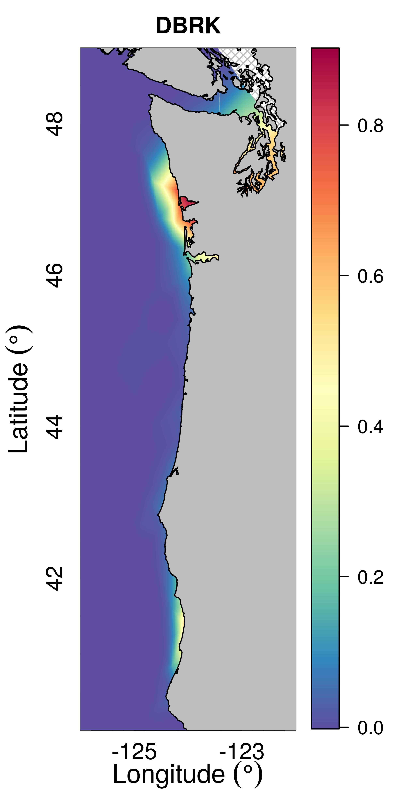{height=450px} 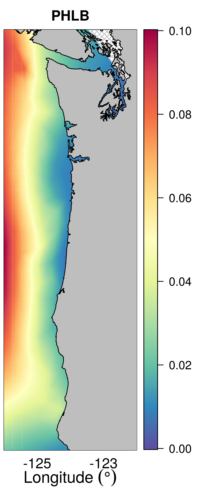{height=450px} 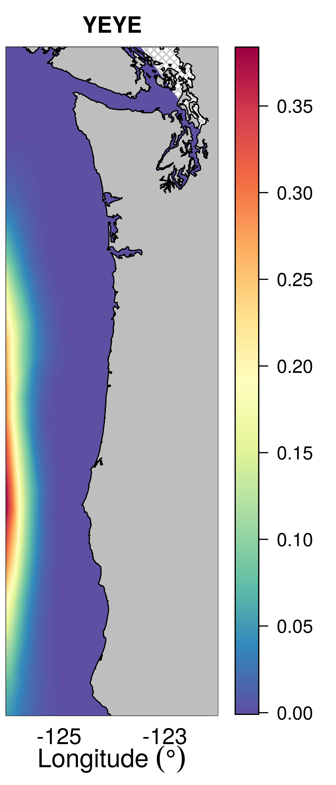{height=450px} 

**Figure S3. GMRF-CONSTANT spatial random field for bycatch probability of the three West Coast groundfish species.** Species abbreviations: DBRK = darkblotched rockfish, PHLB = Pacific halibut, and YEYE = yelloweye rockfish). The GMRF-CONSTANT model estimates one spatial field constant across years from 2003-2012.
</center>

```{r eval=FALSE}
load("/home/brian/Dropbox/bycatch/manuscript/spatial-bycatch/wcann_processed.RData")
minX = min(floor(dat$LON))
maxX = max(ceiling(dat$LON))
minY = min(floor(dat$LAT))
maxY = max(ceiling(dat$LAT))

# cutoff at Lat=40, Long=-122
maxX = -122
minY = 40

# all have same covariates
covar <- c("logDEPTH", "logDEPTH2", "sst", "sst2", "inRCA", "DAY")
n.covar <- length(covar)

plot.sp <- c("DBRK","PHLB","YEYE")
projectedMaps = list()
for(sp in 1:length(plot.sp)){
  load(paste0("/home/brian/Documents/Bycatch/figure_data/fits.bin_",sp,"_1.RData")) # use fold 1
  out.inla <- d[[4]]$out.inla # GMRF CONSTANT = model 4
  fit.id <- d[[4]]$fit.id
  mesh1 <- d[[4]]$mesh1
  iset <- d[[4]]$iset

  stepsize <- 0.01
  nxy <- round(c(maxX-minX, maxY-minY)/stepsize)
  projgrid = inla.mesh.projector(mesh1, xlim = c(minX,maxX), ylim=c(minY,maxY),dims = nxy)
  projectedMaps[[sp]] <- inla.mesh.project(projgrid, out.inla$summary.random$i$mean) + 
          out.inla$summary.fixed["sst",1]*mean(dat$sst) +
          out.inla$summary.fixed["sst2",1]*mean(dat$sst2) + 
          out.inla$summary.fixed["logDEPTH",1]*mean(dat$logDEPTH) + 
          out.inla$summary.fixed["logDEPTH2",1]*mean(dat$logDEPTH2) + 
          out.inla$summary.fixed["inRCA",1]*mean(as.numeric(as.character(dat$inRCA))) +
          out.inla$summary.fixed["DAY",1]*mean(dat$DAY)
  # convert to p-space (bycatch probability) using inverse logit                      
  projectedMaps[[sp]] <- exp(projectedMaps[[sp]])/(1+exp(projectedMaps[[sp]] ))
}

# set color scale
library(RColorBrewer)
rf <- colorRampPalette(rev(brewer.pal(11,'Spectral')))
spec200 <- rf(200)

# load helper functions
library(fields)
source("/home/brian/Dropbox/bycatch/manuscript/figures/fig1_effort_catch/image.scale.R")

# load NE Pacific dataset from the PBSmapping package
data(nepacLL) 

# plot each species separately and stitch together afterward
widths = c(3.5,2.8,3)
heights = rep(7,3)
tot.width <- sum(widths)

for(sp in 1:3) {
   dev.new(width= widths[sp], heights=heights[sp])
   if(sp == 1){ # plot y axis
      par(mar=c(3, 3, 2, 4) + 0.1)
      plotMap(nepacLL, xlim=c(minX,maxX),ylim=c(minY,maxY),col='grey',
              cex.axis=1.5, cex.lab=1.7, main="",plt=NULL)
   }
   if(sp == 2){ # don't plot y axis
      par(mar=c(3, 0, 2, 4) + 0.1)
      plotMap(nepacLL, xlim=c(minX,maxX),ylim=c(minY,maxY),col='grey',
         ylab="", yaxt="n", cex.axis=1.5, cex.lab=1.7, main="",plt=NULL)
   }
   if(sp == 3){ # don't plot y axis
      par(mar=c(3, 0, 2, 5) + 0.1)
      plotMap(nepacLL, xlim=c(minX,maxX),ylim=c(minY,maxY),col='grey',
         ylab="", yaxt="n", cex.axis=1.5, cex.lab=1.7, main="",plt=NULL)
   }   
   rect(minX, minY, maxX, maxY, density = 20, col='grey')
   rect(minX, minY, maxX, maxY, density = 20, col='grey', angle=135)
   title(plot.sp[sp], line=1)

  # minP <- min(projectedMaps[[sp]],na.rm=TRUE)
  maxP <- max(projectedMaps[[sp]],na.rm=TRUE)
  image(projgrid$lattice$x, projgrid$lattice$y, projectedMaps[[sp]], 
        col=spec200, add=T, breaks = seq(0,maxP,length.out=201))
  lev = levels(as.factor(nepacLL$PID))
  for(i in 1:length(lev)) {
    indx = which(nepacLL$PID == lev[i])
    polygon(nepacLL$X[indx], nepacLL$Y[indx], col = "grey")
  }
  if(sp==1) image.plot(smallplot=c(.78,.85,0.09,0.94),col=spec200,zlim=c(0,round(maxP,1)),
                       legend.only=TRUE,legend.shrink=0.3)
  if(sp==2) image.plot(smallplot=c(.73,.8,0.09,0.94),col=spec200,zlim=c(0,round(maxP,1)),
                       legend.only=TRUE,legend.shrink=0.3)
  if(sp==3) image.plot(smallplot=c(.7,.77,0.09,0.94),col=spec200,zlim=c(0,round(maxP,3)),
                       legend.only=TRUE,legend.shrink=0.3)
  dims <- dev.size()
  dev.print(png,paste0("/home/brian/Dropbox/bycatch/manuscript/spatial-bycatch/figures/figS3_spatial_field_sp",sp,".png"), 
            res=700, height=dims[2], width=dims[1], units="in")
}
```
